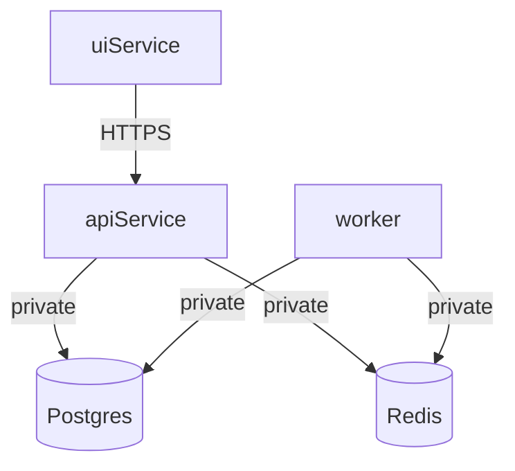

# Deployment (v1): Local first → Railway

This document captures how we intend to deploy the v1 system with a separate operator UI and (optionally) Redis + worker.

## Services

- **ui**: static SPA (operator console)
- **api**: FastAPI HTTP API
- **worker**: background jobs (collect / invite) + Telegram user-client
- **db**: Postgres (Railway managed)
- **redis** (optional but recommended for Railway): queue + job coordination

## Local development (stage 1)

Goal: validate flows end-to-end locally before any cloud deploy.

- **DB**: SQLite
- **Worker**: can be in-process (synchronous) for simplicity, or a separate local process
- **UI**: runs against local `api` base URL

### Local run (proposed)

- **API** (FastAPI): `uvicorn app.main:app --reload`
- **Worker** (optional in stage 1): a separate process that triggers collect/invite runs (stage 2 makes this mandatory)
- **UI**: dev server pointing to `API_BASE_URL=http://127.0.0.1:8000`

UI quickstart:

```bash
cd ui
copy .env.example .env
npm install
npm run dev
```

Verification gate:

```bash
pytest tests/ -v --tb=short
```

## Railway deployment (stage 2)

### Recommended topology



### Environment variables (draft)

**api**
- `DATABASE_URL`
- `REDIS_URL` (if Redis enabled)
- `ADMIN_TOKEN` (mandatory for write endpoints)
- `CORS_ALLOWED_ORIGINS` (ui origin)

**worker**
- `DATABASE_URL`
- `REDIS_URL`
- `TG_API_ID`
- `TG_API_HASH`
- `TG_SESSION_STRING` (or session file path if supported; prefer string)

**ui**
- `API_BASE_URL` (public URL of `api`)

### Railway step-by-step (proposed)

1) Create managed **Postgres** and set `DATABASE_URL` for `api` + `worker`.

2) (Recommended) Create managed **Redis** and set `REDIS_URL` for `api` + `worker`.

3) Create services:
- **api**: FastAPI app
- **worker**: background worker (no public ingress)
- **ui**: static SPA build (public)

4) Set per-service env vars (least privilege):
- `ui`: only `API_BASE_URL`
- `api`: `DATABASE_URL`, `REDIS_URL`, `ADMIN_TOKEN`, `CORS_ALLOWED_ORIGINS`
- `worker`: `DATABASE_URL`, `REDIS_URL`, `TG_API_ID`, `TG_API_HASH`, `TG_SESSION_STRING`

5) Networking:
- `api` and `ui` are public.
- `worker`, `db`, and `redis` must be private-only.

6) Go-live blockers to clear before deploying any real Telegram session:
- Enforce `ADMIN_TOKEN` auth on mutating API routes.
- Enforce CORS (allow only the UI origin).
- Fix FloodWait behavior (pause/abort + persisted backoff).
- Enforce pacing policy (max/minute, max/hour) in worker.

## Worker split (current implementation)

When `REDIS_URL` is set:
- `POST /collect-runs` creates a `CollectRun` with `status="queued"` and enqueues it via RQ.
- `POST /invite-runs` creates an `InviteRun` with `status="queued"` and enqueues it via RQ.
- Start the worker process with:

```bash
python -m app.worker
```

When `REDIS_URL` is not set (local-first):
- API falls back to synchronous execution in-request (keeps local dev and tests simple).

### Operational notes

- Only `api` and `ui` should be public.
- `worker`, `db`, `redis` must be private-only.
- Prior to go-live, implement and enforce:
  - `Authorization: Bearer <ADMIN_TOKEN>` for all mutating endpoints
  - FloodWait abort/pause behavior and pacing limits (see `docs/SECURITY.md` + QA bugs)

